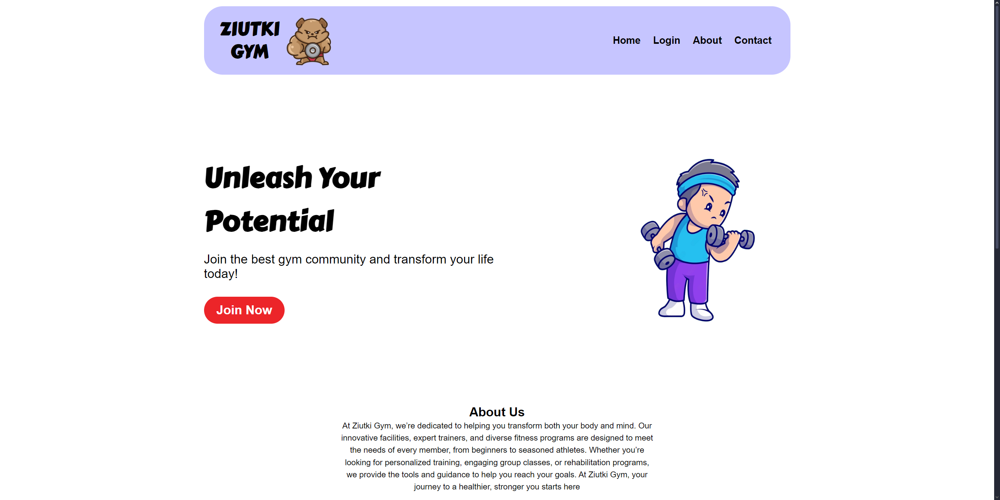
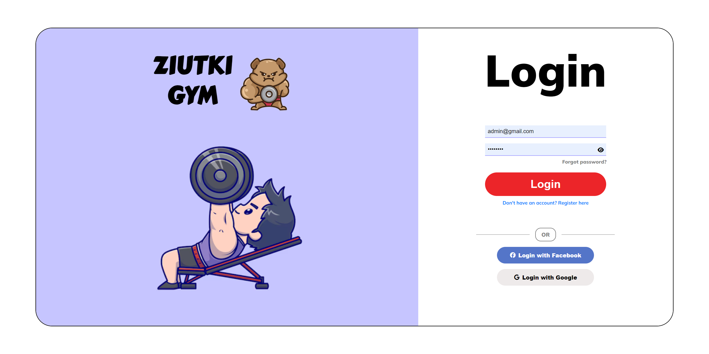
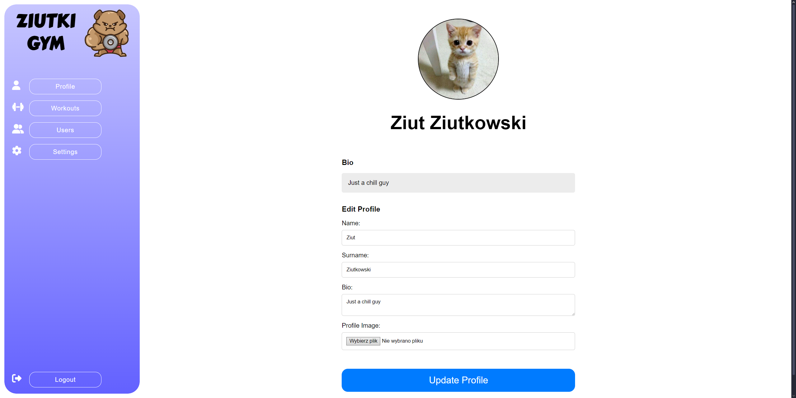
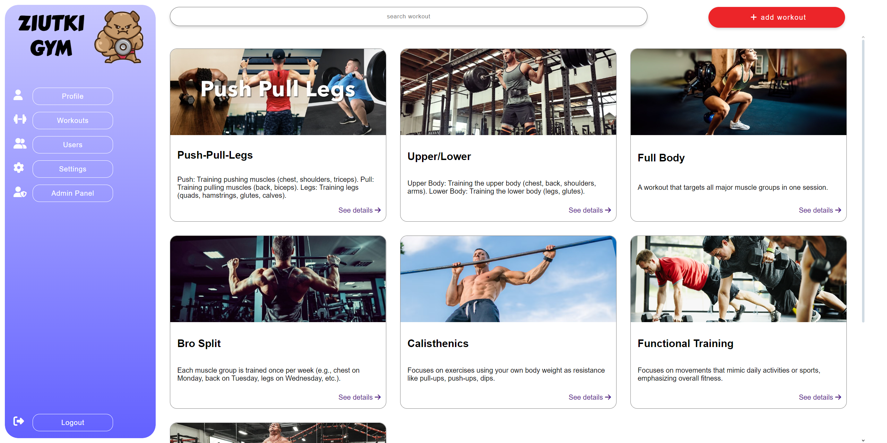
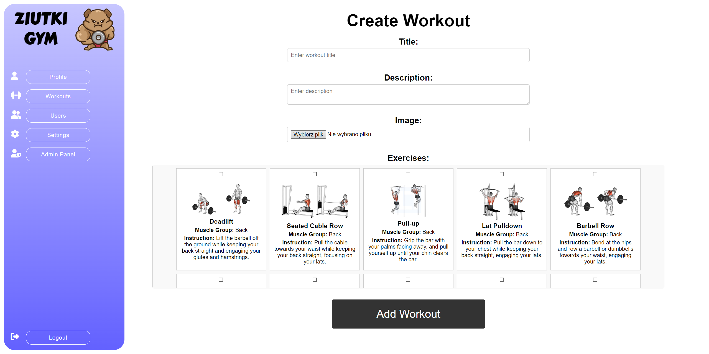

# ZIUTKI GYM Web Application

## Project Description
ZIUTKI GYM is a web application designed for users who want to manage their profile, workout plans, and interactions with other users. The application offers functionalities such as:

- Creating and managing workouts
- Managing user profiles
- Searching for users and workouts
- Displaying workouts created by other users
- Limiting the number of workouts to 3 per user

---

## Features

### Profiles
- Edit user data (name, surname, bio, profile picture).
- Set new password, email or change profile visibility
- Validate uploaded files:
  - Maximum size: **1MB**.
  - Supported formats: **image/png**, **image/jpeg**.

### Workouts
- Creating new workouts:
  - Maximum 3 workouts per user.
  - Adding exercises to a workout.
  - Uploading workout images.
- Displaying workouts:
  - User’s workouts.
  - Public basic workouts.
- Deleting workouts (limited to owners or administrators).

### Search
- Search workouts by title or description.
- Display results as a list of JSON objects in the format:
  ```json
  {
      "id": "Workout ID",
      "title": "Title",
      "description": "Description",
      "user_id": "User ID",
      "image": "Image filename"
  }
  ```

---

## Technologies
- **Frontend**:
  - HTML5, CSS3
  - JavaScript (optional dynamic interactions)
- **Backend**:
  - PHP (classes, methods, data validation)
  - PostgreSQL (data management)

---

## Project Structure

### Main Directories:
- **/public**: Public files (HTML views rendered by PHP, CSS, JS, images).
- **/repository**: Data access layer (repositories).
- **/controllers**: Business logic (PHP controllers).
- **/models**: Model classes (e.g., User, Workout, Exercise).

---

## Installation
1. **Clone the project**:
   ```bash
   git clone https://github.com/your-repo/ziutki-gym.git
   ```

2. **Run the project using Docker**:
   ```bash
   cd ziutki-gym
   docker-compose up --build
   ```

3. **Configure the database**:
   - Ensure that the database container is running.
   - Connect to the database container and import the SQL migration file.
   ```bash
   docker exec -i database_container_name psql -U username -d ziutki_gym < database/migrations.sql
   ```
After completing these steps, the application will be available at http://localhost:8080.
---

## Usage
1. **Register and log in**:
   - Create an account.
   - Log in to access application features.

2. **Creating workouts**:
   - Enter title, description, image, and exercises.
   - Add up to 3 workouts.

3. **Managing profile**:
   - Update profile picture, name, surname, and bio.
   - View workouts linked to the user.

4. **Searching**:
   - Search workouts by keywords in title or description.

---

## Screenshots

### Home Page


### Login Page


### User Profile


### Workouts View


### Create Workout Form


---

## Author
- [Oskar Basiaga](https://github.com/basiagaoskar)